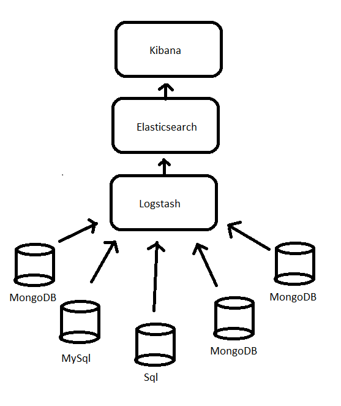

# The ELK stack #

ELK is an acronym for Elasticsearch, Logstach and Kibana.

Elasticsearch is a search and analystic engine,
is json JSON based and has rich APIs.

Logstash is a data collection transportation pipeline. It is designed to process a growing list of log, event and unstructured data sources for distribution into a variety of outputs, including
Elasticsearch.

Kibana is a data visualation platform that you can interact with, and visualize data.

Togeather these components make the ELK stack.
Every component is a separate project but work well
togeather.

A lot of data, from many sources might be parsed from Logstash to Elasticsearch, and from Kibana you
can interact with the from Elasticsearch.

The ELK stack scales very vell and is there for good
for keeping track of a lot of data.
